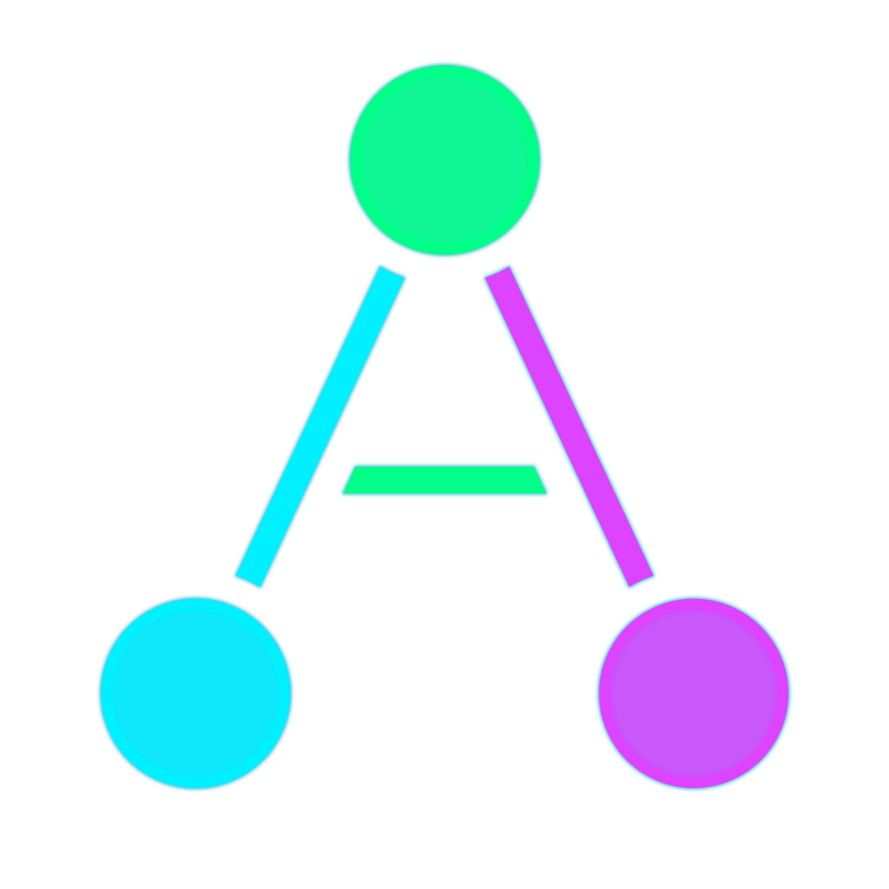

<p align="center">
  
</p>

# Agent Almanac

[](https://github.com/pjt222/agent-almanac/actions/workflows/validate-skills.yml)
[](https://github.com/pjt222/agent-almanac/actions/workflows/update-readmes.yml)
[](LICENSE)
[](https://github.com/sponsors/pjt222)

A library of executable skills, specialist agents, and pre-built teams for [Claude Code](https://docs.anthropic.com/en/docs/claude-code) and compatible AI tools. Define repeatable engineering procedures once and have AI agents execute them with built-in validation and error recovery. Compose specialists into review teams that catch issues a single reviewer would miss. Built on the [Agent Skills open standard](https://agentskills.io).

## At a Glance

<!-- AUTO:START:stats -->
- **310 skills** across 55 domains — structured, executable procedures
- **64 agents** — specialized Claude Code personas covering development, review, compliance, and more
- **13 teams** — predefined multi-agent compositions for complex workflows
- **16 guides** — human-readable workflow, infrastructure, and reference documentation
- **Interactive visualization** — force-graph explorer with 310 R-generated skill icons and 9 color themes
<!-- AUTO:END:stats -->

## How It Works

| Building Block | Location | Purpose |
|----------------|----------|---------|
| **[Skills](skills/README.md)** | `skills/<skill-name>/SKILL.md` | Executable procedures (*how*) |
| **[Agents](agents/README.md)** | `agents/<name>.md` | Specialized personas (*who*) |
| **[Teams](teams/README.md)** | `teams/<name>.md` | Multi-agent compositions (*who works together*) |
| **[Guides](guides/README.md)** | `guides/<name>.md` | Human-readable reference (*context*) |

Ask Claude Code to review your R package, and the [r-package-review](teams/r-package-review.md) team activates 4 agents — each following specialized skills for code quality, architecture, security, and best practices — then synthesizes their findings into a single report.

## Quick Start

### Prerequisites

- [Claude Code](https://docs.anthropic.com/en/docs/claude-code) CLI installed
- This repository cloned: `git clone https://github.com/pjt222/agent-almanac.git`
- Node.js (for README generation and the visualization)

### Try it

In Claude Code, from this repository directory:

```
> "Use the code-reviewer agent to review my latest changes"
> "Follow the commit-changes skill to stage and commit"
> "Activate the r-package-review team to review this package"
```

### Make skills available as slash commands

```bash
ln -s ../../skills/commit-changes .claude/skills/commit-changes
# Then invoke with /commit-changes in Claude Code
```

### Explore visually

```bash
cd viz && npx vite
# Open http://localhost:5173 for the interactive force-graph explorer
```

See [viz/README.md](viz/README.md) for full build instructions.

## Guides

New here? Start with [Understanding the System](guides/understanding-the-system.md). See [all guides](guides/README.md) for the full categorized list.

<!-- AUTO:START:guides -->
**Workflow**

- [Understanding the System](guides/understanding-the-system.md) — Entry point: what skills, agents, and teams are, how they compose, and how to invoke them
- [Creating Skills](guides/creating-skills.md) — Authoring, evolving, and reviewing skills following the agentskills.io standard
- [Creating Agents and Teams](guides/creating-agents-and-teams.md) — Designing agent personas, composing teams, and choosing coordination patterns
- [Running a Code Review](guides/running-a-code-review.md) — Multi-agent code review using review teams for R packages and web projects
- [Managing a Scrum Sprint](guides/managing-a-scrum-sprint.md) — Running Scrum sprints with the scrum-team: planning, dailies, review, and retro
- [Visualizing Workflows with putior](guides/visualizing-workflows-with-putior.md) — End-to-end putior workflow visualization from annotation to themed Mermaid diagrams
- [Running Tending](guides/running-tending.md) — AI meta-cognitive tending sessions with the tending team
- [AgentSkills Alignment](guides/agentskills-alignment.md) — Standards compliance audits using the agentskills-alignment team for format validation, spec drift detection, and registry integrity

**Infrastructure**

- [Setting Up Your Environment](guides/setting-up-your-environment.md) — WSL2 setup, shell config, MCP server integration, and Claude Code configuration
- [Symlink Architecture](guides/symlink-architecture.md) — How symlinks enable multi-project discovery of skills, agents, and teams through Claude Code
- [R Package Development](guides/r-package-development.md) — Package structure, testing, CRAN submission, pkgdown deployment, and renv management

**Reference**

- [Quick Reference](guides/quick-reference.md) — Command cheat sheet for agents, skills, teams, Git, R, and shell operations
- [Agent Best Practices](guides/agent-best-practices.md) — Design principles, quality assurance, and maintenance guidelines for writing effective agents
- [Agent Configuration Schema](guides/agent-configuration-schema.md) — YAML frontmatter field definitions, validation rules, and JSON Schema for agent files

**Design**

- [Extracting Project Essence](guides/extracting-project-essence.md) — Multi-perspective framework for extracting skills, agents, and teams from any codebase using the metal skill
- [Epigenetics-Inspired Activation Control](guides/epigenetics-activation-control.md) — Runtime activation profiles controlling which agents, skills, and teams are expressed, grounded in molecular epigenetics
<!-- AUTO:END:guides -->

## Contributing

Contributions welcome! Each content type has its own guide:

- **Skills** — [skills/README.md](skills/README.md) for format and consumption
- **Agents** — [agents/README.md](agents/README.md) for template and best practices
- **Teams** — [teams/README.md](teams/README.md) for coordination patterns
- **Guides** — [guides/README.md](guides/README.md) for categories and template

Update the relevant `_registry.yml` when adding content, then run `npm run update-readmes`.

## Support

If Agent Almanac makes your AI tools more capable, consider [sponsoring its development](https://github.com/sponsors/pjt222).

Reliable AI assistance requires structured knowledge — and maintaining that structure is work that the models themselves cannot do.

## License

MIT License. See [LICENSE](LICENSE) for details.
