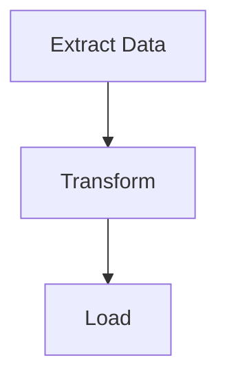

# Generate Workflow Diagram

Generate a themed Mermaid flowchart diagram from putior workflow data and embed it in documentation.

## When to Use

- After annotating source files and ready to produce the visual diagram
- Regenerating a diagram after workflow changes
- Switching themes or output formats for different audiences
- Embedding workflow diagrams in README, Quarto, or R Markdown documents

## Inputs

- **Required**: Workflow data from `put()`, `put_auto()`, or `put_merge()`
- **Optional**: Theme name (default: `"light"`; options: light, dark, auto, minimal, github, viridis, magma, plasma, cividis)
- **Optional**: Output target: console, file path, clipboard, or raw string
- **Optional**: Interactive features: `show_source_info`, `enable_clicks`

## Procedure

### Step 1: Extract Workflow Data

Obtain workflow data from one of three sources.

```r
library(putior)

# From manual annotations
workflow <- put("./src/")

# From auto-detection only
workflow <- put_auto("./src/")

# From merged (manual + auto)
workflow <- put_merge("./src/", merge_strategy = "supplement")
```

**Expected:** A data frame with at least one row, containing `id`, `label`, and optionally `input`, `output`, `source_file` columns.

**On failure:** If the data frame is empty, no annotations or patterns were found. Run `analyze-codebase-workflow` first, or check that annotations are syntactically valid with `put("./src/", validate = TRUE)`.

### Step 2: Select Theme and Options

Choose a theme appropriate for the target audience.

```r
# List all available themes
get_diagram_themes()

# Standard themes
# "light"   — Default, bright colors
# "dark"    — For dark mode environments
# "auto"    — GitHub-adaptive with solid colors
# "minimal" — Grayscale, print-friendly
# "github"  — Optimized for GitHub README files

# Colorblind-safe themes (viridis family)
# "viridis" — Purple→Blue→Green→Yellow, general accessibility
# "magma"   — Purple→Red→Yellow, high contrast for print
# "plasma"  — Purple→Pink→Orange→Yellow, presentations
# "cividis" — Blue→Gray→Yellow, maximum accessibility (no red-green)
```

**Expected:** Theme names printed. Select one based on context.

**On failure:** If a theme name is not recognized, `put_diagram()` falls back to `"light"`. Check spelling.

### Step 3: Generate Mermaid Output

Produce the diagram in the desired output mode.

```r
# Print to console (default)
cat(put_diagram(workflow, theme = "github"))

# Save to file
writeLines(put_diagram(workflow, theme = "github"), "docs/workflow.md")

# Get raw string for embedding
mermaid_code <- put_diagram(workflow, output = "raw", theme = "github")

# With source file info (shows which file each node comes from)
cat(put_diagram(workflow, theme = "github", show_source_info = TRUE))

# With clickable nodes (for VS Code, RStudio, or file:// protocol)
cat(put_diagram(workflow,
  theme = "github",
  enable_clicks = TRUE,
  click_protocol = "vscode"  # or "rstudio", "file"
))

# Full-featured
cat(put_diagram(workflow,
  theme = "viridis",
  show_source_info = TRUE,
  enable_clicks = TRUE,
  click_protocol = "vscode"
))
```

**Expected:** Valid Mermaid code starting with `flowchart TD` (or `LR` depending on direction). Nodes are connected by arrows showing data flow.

**On failure:** If the output is `flowchart TD` with no nodes, the workflow data frame is empty. If connections are missing, check that output filenames match input filenames across nodes.

### Step 4: Embed in Target Document

Insert the diagram into the appropriate documentation format.

**GitHub README (```mermaid code fence):**
````markdown
## Workflow


````

**Quarto document (native mermaid chunk via knit_child):**
```r
# Chunk 1: Generate code (visible, foldable)
workflow <- put("./src/")
mermaid_code <- put_diagram(workflow, output = "raw", theme = "github")
```

```r
# Chunk 2: Output as native mermaid chunk (hidden)
#| output: asis
#| echo: false
mermaid_chunk <- paste0("```{mermaid}\n", mermaid_code, "\n```")
cat(knitr::knit_child(text = mermaid_chunk, quiet = TRUE))
```

**R Markdown (with mermaid.js CDN or DiagrammeR):**
```r
DiagrammeR::mermaid(put_diagram(workflow, output = "raw"))
```

**Expected:** Diagram renders correctly in the target format. GitHub renders mermaid code fences natively.

**On failure:** If GitHub doesn't render the diagram, ensure the code fence uses exactly ` ```mermaid ` (no extra attributes). For Quarto, ensure the `knit_child()` approach is used since direct variable interpolation in `{mermaid}` chunks is not supported.

## Validation

- [ ] `put_diagram()` produces valid Mermaid code (starts with `flowchart`)
- [ ] All expected nodes appear in the diagram
- [ ] Data flow connections (arrows) are present between connected nodes
- [ ] Selected theme is applied (check init block in output for theme-specific colors)
- [ ] Diagram renders correctly in the target format (GitHub, Quarto, etc.)

## Common Pitfalls

- **Empty diagrams**: Usually means `put()` returned no rows. Check annotations exist and are syntactically valid.
- **All nodes disconnected**: Output filenames must exactly match input filenames (including extension) for putior to draw connections. `data.csv` and `Data.csv` are different.
- **Theme not visible on GitHub**: GitHub's mermaid renderer has limited theme support. The `"github"` theme is specifically designed for GitHub rendering. The `%%{init:...}%%` theme block may be ignored by some renderers.
- **Quarto mermaid variable interpolation**: Quarto's `{mermaid}` chunks don't support R variables directly. Use the `knit_child()` technique described in Step 4.
- **Clickable nodes not working**: Click directives require a renderer that supports Mermaid interaction events. GitHub's static renderer does not support clicks. Use a local Mermaid renderer or the putior Shiny sandbox.

## Related Skills

- `annotate-source-files` — prerequisite: files must be annotated before diagram generation
- `analyze-codebase-workflow` — auto-detection can supplement manual annotations
- `setup-putior-ci` — automate diagram regeneration in CI/CD
- `create-quarto-report` — embed diagrams in Quarto reports
- `build-pkgdown-site` — embed diagrams in pkgdown documentation sites
